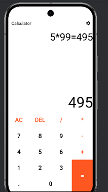
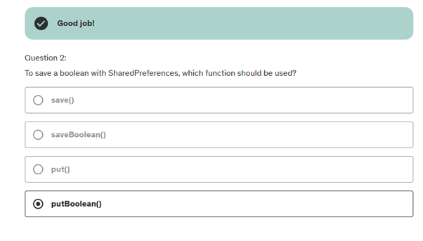
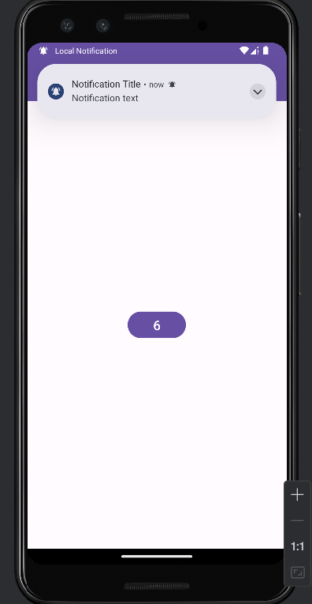
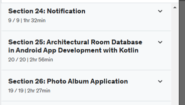

# Лабораторна робота №5
## Програмування для мобільних пристроїв
### Харківський національний економічний університет ім. С.Кузнеця

**Виконала**: Бабачанах К.С., студентка 4 курсу групи 6.04.122.010.21.2, факультету ІТ

---

## Вступ

Цей репозиторій містить усі виконані роботи та проекти.

---

## Огляд розділів

### Section 17: Publishing Your App on Google

У цій секції я ознайомилася з теорією та корисною інформацією про критичні аспекти розробки та розгортання Android-додатків. Було розглянуто важливість версії релізу APK, процес побудови APK файлів, створення облікового запису розробника Google Play та процес публікації додатка в Google Play Store.

1.	**Version Code і Version Name:** Вивчення версійності APK допомогло мені зрозуміти, що кожен реліз додатка має мати унікальний код версії (Version Code), який має бути цілочисельним значенням та збільшуватися з кожним оновленням. Версія назви (Version Name) відображається користувачам та допомагає їм ідентифікувати версію додатка.
2.	**Building APK Files:** Мені було показано, як згенерувати підписаний APK файл через Android Studio, що є кроком перед публікацією додатка.
3.	**Google Play Developer Account:** Я навчилася створювати обліковий запис розробника в Google Play, що є необхідністю для публікації додатків на цій платформі. Були обговорені важливі кроки та вимоги для активації облікового запису та управління публікаціями.
4.	**Release Your App:** Завершальною частиною було вивчення процесу публікації додатка в Google Play, включаючи налаштування політики конфіденційності, вибір країн для розгортання, оцінку контенту додатка та завантаження необхідних активів (іконки, знімки екрану).

- **У кінці секції 17 я пройшла тест**
  

---

### Section 18: Android Project 2 – Kotlin

У цій секції потрібно було створити математичну гру.

- **Запуск застосунку**
  

- **Обираємо першу кнопку**
  

- **Граємо**
  

- **Quiz 18**
  

---

### Section 19: Calculator Application

У цій секції потрібно було створити калькулятор.

- **Калькулятор**

- **множення**
  

- **налаштування**
  

- **чорна тема**
  

- **Quiz 19**
  

---

### Section 20: Fragment Operations in Android App Development, Kotlin

На цьому розділі я вивчила фрагменти у розробці мобільних додатків. Вони мають кілька ключових аспектів:

1.	**Введення в тему фрагментів:**
Фрагменти є частиною користувацького інтерфейсу в Android-додатках, які можуть бути використані повторно в різних активностях. Вони допомагають управляти більш складними інтерфейсами.
2.	**Загальна інформація про фрагменти:**
Фрагменти мають власний життєвий цикл, можуть обробляти власні події вводу та можуть бути додані або видалені з активності динамічно.
3.	**Створення фрагменту:**
Обговорюються основи створення фрагментів, включаючи декларування в XML та управління через Kotlin код.
4.	**Заміна фрагменту в активності на інший фрагмент:**
Розглядається процес динамічної заміни фрагментів в рамках активності, з використанням транзакцій.
5.	**Фрагмент Backstack:**
Пояснюється як управляти стеком навігації між фрагментами, забезпечуючи зворотній перехід між фрагментами.
6.	**List Fragment:**
Розглядаються особливості роботи з ListFragment для створення списків в межах фрагменту, управління даними та адаптерами.
7.	**Dialog Fragment:**
Обговорюються специфіки створення діалогових вікон як фрагментів, включаючи кастомізацію вигляду та поведінки.

- **Creating and Using Fragments**
  

- **Quiz 20**
  

---

### Section 21: Sending Data Between Screens in Mobile App Development and Android.

Отже, у цьому розділі я розглянула та спробувала на практиці передачу даних між компонентами в Android додатках на Kotlin:

1.	**Передача даних між активностями:**
Обговорюється процес передачі даних між активностями через Intent. Розглядаються різні методи внесення даних до Intent і відправки їх до наступної активності.
Також пояснюються підходи до отримання цих даних у цільовій активності, включаючи використання екстра (Extras) із Intent.
2.	**Передача даних від активності до фрагменту:**
Вивчається як передавати дані від активності до фрагменту, використовуючи Bundle для капсулювання даних і метод setArguments() для передачі цього пакета фрагменту.
Розглядаються приклади як передати дані при створенні фрагмента і як ці дані можна отримати всередині фрагмента.
3.	**Передача даних від фрагменту до активності :**
Пояснюється, як фрагмент може взаємодіяти з активністю, використовуючи різні механізми, такі як виклик методів активності напряму чи через інтерфейси.
Демонструється процес виклику методів активності з фрагмента для оновлення даних або управління активністю.
4.	**Передача даних між фрагментами:**
Розкривається механізм комунікації між фрагментами, зазвичай через спільну активність, яка діє як посередник.
Обговорюються способи передачі даних, включно з використанням спільного ViewModel для обміну даними між фрагментами без залучення активності.

- **Вводжу данні та відправляю**

- **Отримаю**
  

- **Communication between Activity and Fragments**
  

- **Quiz 21**
  

---

### Section 22: Flag Quiz App

У цій секції потрібно було створити квіз.

- **Навигация**

- **Завантаження застосунку**

- **Починаємо грати**

- **обираю не правильну відповідь**

- **обираю правильну відповідь**

- **Quiz 22**
  

---

### Section 23: Accessing the Features of Android Device in android app.

Цій розділ був зосереджений на доступі до різних функцій Android пристроїв, таких як відправлення SMS, електронних листів, здійснення телефонних дзвінків та перетворення мови в текст. Кожна з цих тем охоплює важливі функціональні можливості, які можуть підвищити інтерактивність вашого додатку Android. Отже, ось що я дізналась:

1.	**Відправлення SMS:**
•	Використання SmsManager для відправки текстових повідомлень.
•	Необхідність дозволу SEND_SMS.
•	Обробка статусу доставки за допомогою PendingIntent.

2.	**Відправлення електронної пошти:**
•	Запуск клієнта електронної пошти з допомогою Intent.ACTION_SEND.
•	Автоматичне заповнення полів адреси, теми та тексту листа.

3.	**Здійснення дзвінків:**
•	Використання Intent.ACTION_CALL для ініціації дзвінків.
•	Потреба в дозволі CALL_PHONE.

4.	**Перетворення мови в текст:**
•	Використання SpeechRecognizer або RecognizerIntent для розпізнавання мови.
•	Управління мікрофоном і дозволом RECORD_AUDIO.

- **Як відправити SMS з Kotlin**

- **Приклад програми до та після надсилання повідомлення**
  

- **Як надіслати електронну пошту в Android за допомогою інтернету**
  

- **Здійснення дзвінка в Android, Kotlin, Java**
  

- **Quiz 23**
  

---

### Section 24: Notification

У цьому розділі було охоплено ключові аспекти роботи з системою повідомлень, включаючи створення та відправку локальних повідомлень, налаштування повторюваних повідомлень, детальні процедури створення багатофункціональних повідомлень з використанням додаткових кнопок та графіки, а також використання push-повідомлень для ефективної взаємодії з користувачами в реальному часі.

- **запуск застосунку**

- **дозвіл на сповіщення**
  

- **Повідомлення**
  

- **Повторювані повідомлення - запуск застосунку**
  

- **дозвіл на повторювані сповіщення**
  

- **Обраємо час**
  

- **Отримаємо повідомлення**
  

- **Процедури повідомлень – даємо дозвілс**
  

- **Процедури повідомлень - отримаємо повідомлення**
  

- **Push Notifications**
  

- **Quiz 24**
  

---

### Section 25: Architectural Room Database in Android App Development with Kotlin

У цьому розділі розглядається робота з базами даних, включаючи використання SQLite і Room Database, а також створення повноцінного додатку для ведення записів. Ось краткий огляд основних тем:

1.	**Основи баз даних** – введення у поняття баз даних та їх важливість у програмуванні.
2.	**SQLite Database** – основи роботи з SQLite, легковага транзакційна база даних, що вбудована в Android.
3.	**Room Database** – вищий рівень абстракції для SQLite, що забезпечує більш зручну роботу з базами даних через анотації та DAO (Data Access Objects).

4.	**Архітектурні компоненти** – вивчення архітектурних компонентів, які використовуються для побудови структурованого та стабільного додатку.

  

5.	**Створення додатку для ведення записів** – розробка базової структури додатку з Kotlin.
6.	**Створення елементів бази даних:**

- **Entity:** Оголошення моделей даних.
  

- **DAO:** Визначення інтерфейсів для доступу до даних.
  

- **Database:** Створення самої бази даних
  

- **Repository :** Логіка взаємодії між базою даних і UI
  

- **View Model:** Управління даними UI.

7.	**Дизайн користувацького інтерфейсу** – створення інтерфейсу для додатку.
8.	**Робота з RecyclerView через Adapter** – показ даних з бази в списковому вигляді.
9.	**Додавання, видалення та оновлення даних** – функціонал для зміни даних користувачем у базі.

- **Quiz 25**
  

---

### Section 26: Photo Album Application

У цій секції потрібно було створити Photo Album Application.

- **Запуск застосунку**

- **Потрібно ввести текст та обрати фото**
  

- **Обираю фото**
  

- **Додаю картку до альбому**
  

- **Картка додана**
  

- **Змінюю параметри**
  

- **Ось новий текст обновився**
  

- **Quiz 26**
  

---

## Заключення

Цей курс надав глибоке розуміння розробки мобільних додатків на платформі Android, з акцентом на практичне застосування здобутих теоретичних знань.

---

### Усі секції пройдені

